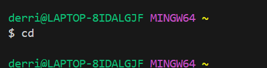
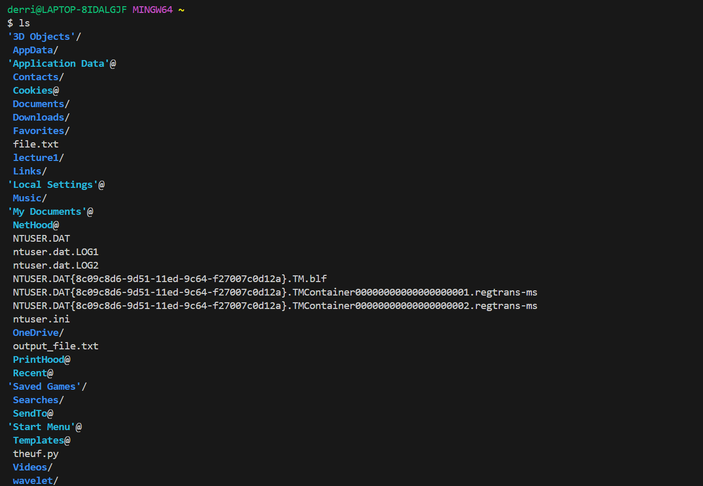
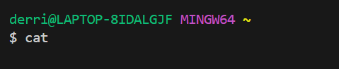
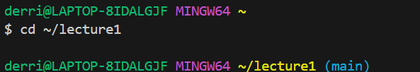
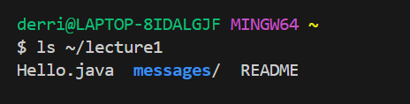
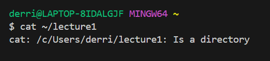
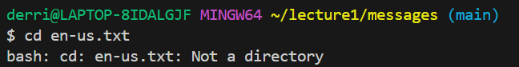

# Lab Report 1 - Remote Access and FileSystem (Week 1) - Derrick Burton
You’ll submit a lab report by writing a blog post about the basic filesystem commands we learned today. You should create the post, like we just described using Github Pages. The lab report is due Tuesday, April 9 by 10pm. See the FAQ below for common questions, including how to add images and what to submit to Gradescope.

For **each** of the commands `cd`, `ls`, and `cat`, and using the workspace you created in this lab:

1. Share an example of using the command with no arguments.
2. Share an example of using the command with a path to a *directory* as an argument.
3. Share an example of using the command with a path to a *file* as an argument.

So that's 9 total examples (3 for each command). **For each of the 9 examples**, include:

* A screenshot or Markdown code block showing the command and its output.
* What the **absolute path** to the working directory was **right before** the command was run.
* A sentence or two explaining why you got that output (e.g. what was in the filesystem, what it meant to have no arguments).
* Indicate explicitly whether the output is an *error* or not, and if it's an error, explain why it's an error in one or two sentences. **Note:** Make sure to use backticks  around keywords such as commands, file names, paths, etc. to make them show up as code like `cd`.

___

## Lab Report

**1. Commands with no arguments:**
>`cd` with no arguments:
   * 
   * The absolute path before the command was run was `~`.
   * Since no directory was specified, `cd` outputs nothing and changes nothing. The directory remains at `~`.
   * The output is not an error. Since we do not specify a directory when running the change directory command, it is expected the directory will not change.
   ___
   >`ls` with no arguments
   * 
   * The absolute path before the command was run was `~`.
   * The reason I get this output is because using `ls` with no arguments causes it to default to the current working directory. Given that the current working directory is `~` (or `/home`) it outputs all files and directories available from `/home`, which is what you see here.
   * This output is not an error, this is exactly what I expect to see when using the `ls` command.
___
>`cat` with no arguments:
* 
* The absolute path before the command was run was `~`.
* The reason I get this output is because  `cat` is expecting a file as an argument. With no file argument it has nothing to display.
* I would consider this output an error, `cat` requires an argument in order to work correctly. Also, in order to continue using the terminal I had to use `Ctrl + C` to abort the cat function, indicating that it was still running but outputting nothing.
___
**2. Commands with directory arguments:**
>`cd` with directory argument:

* 
* The absolute path before the command was run was `~`.
* After running the command, the working directory changes to `~/lecture1`. The reason for this is that `cd` and a directory argument changes the working directory to the specificied directory.
* This is not an error, cd works exactly as expected.
___
>`ls` with directory argument
* 
* The absolute path before the command was run was `~`.
* I got this output because these are the directories and files inside the directory I specified when using `ls`. The directory argument I specified was `~/lecture1`, so these are the files and directories inside lecture1.
* This output is not an error, `ls` works exactly as expected.
___
>`cat` with directory argument
* 
* The absolute path before the command was run was `~`.
* I got this output because `cat` requires a file in order to correctly display contents. This output just informs me that the argument is a directory and not what is expected, a file.
* Although `cat` isn't working exactly as intended, this output is not an error.
___
**3. Commands with file argument:**
>`cd` with file argument
* 
* The absolute path before the command was run was `~/lecture1/messages`
* I got this output because `cd` requires a directory argument in order to work correctly. Similarly to running cat with a directory instead of a file, this output informs me that the argument is not what is expected, not a directory.
* Although `cd` isn't working exactly as intended, this output is not an error.
>`ls` with file argument
* 
* 
