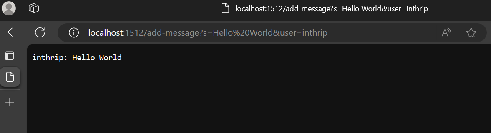
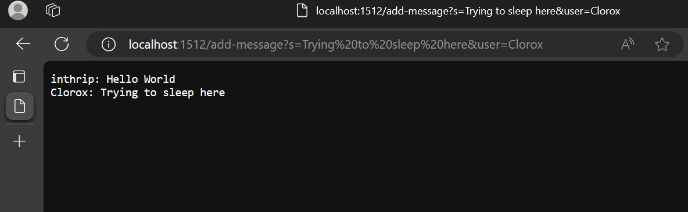
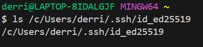
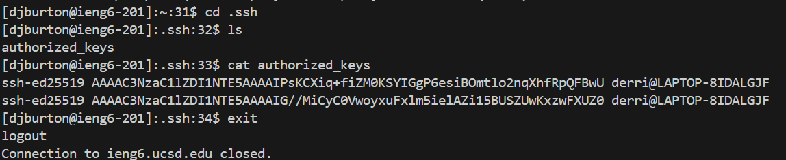
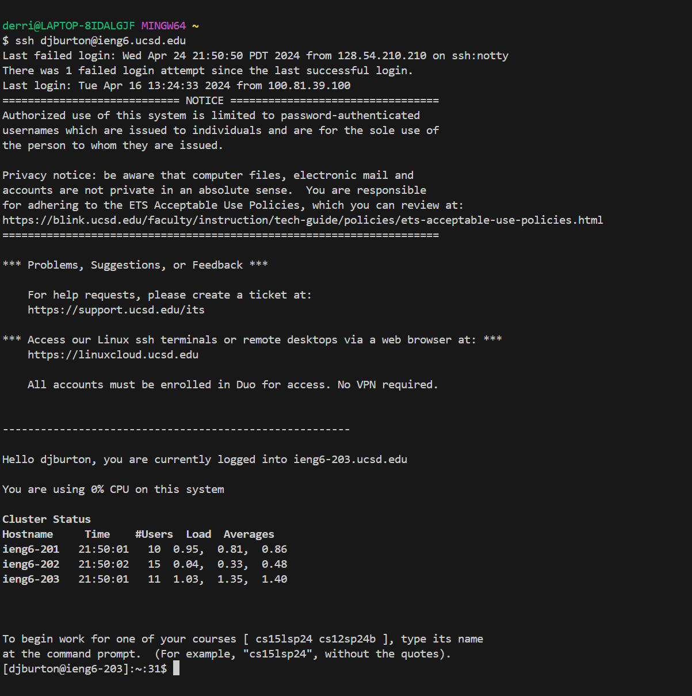

# Lab Report 2 - Servers and SSH Keys 
Derrick Burton

## Part 1:
### The code for ChatServer.java:
~~~
import java.io.IOException;
import java.net.URI;

class Handler implements URLHandler {
    String str = "";
    public String handleRequest(URI url) {
        if (url.getPath().equals("/")) {
            return String.format(str);
        } 
         else {
            if (url.getPath().contains("/add-message")) {
                String[] parameters = url.getQuery().split("&");
                String[] msgpart = parameters[0].split("=");
                String msg = msgpart[1];
                String[] userpart = parameters[1].split("=");
                String user = userpart[1];
                str  += user + ": " + msg + "\n";
                return str;
                }
            }
            return "404 Not Found!";
        }
    }

class ChatServer {
    public static void main(String[] args) throws IOException {
        if(args.length == 0){
            System.out.println("Missing port number! Try any number between 1024 to 49151");
            return;
        }

        int port = Integer.parseInt(args[0]);

        Server.start(port, new Handler());
    }
}
~~~
## First Usage of `/add-message`:

Which methods in your code are called?
- The method that is called is handleRequest.

What are the relevant arguments to those methods, and the values of any relevant fields of the class?
- The relevant argument to this method is `/add-message?s=Hello%20World&user=inthrip`, this method returns what we see displayed.
- The 'str' field is the relevant field of this class, the value of this field before the arugment is passed is "".

How do the values of any relevant fields of the class change from this specific request? If no values got changed, explain why.
- The value of the 'str' field is updated when the relevant argument is passed, it becomes "inthrip: Hello World\n"

## Second Usage of `/add-message`:

Which methods in your code are called?
- The method that is called is handleRequest.

What are the relevant arguments to those methods, and the values of any relevant fields of the class?
- The relevant argument to this method is `/add-message?s=Trying%20to%20sleep%20here&user=Clorox`, this method returns what we see displayed.
- The 'str' field is the relevant field of this class, the value of this field before the arugment is passed is "inthrip: Hello World\n.

How do the values of any relevant fields of the class change from this specific request? If no values got changed, explain why.
- The value of the 'str' field is updated from "inthrip: Hello World\n" to "inthrip: Hello World\n Clorox: Trying to sleep here/n" when the relevant argument is passed.

## Part 2:
1. 
---
2. 
---
3. 

## Part 3:
I learned quite a few things during this lab that I had no knowledge of before. For one, I learned how to use ssh keys and how they are very time-saving when it it comes to logging in remotely. Alongside that, I also learned how to use scp, which I'm sure will come in extremely handy whenever I need to copy files between locations.
