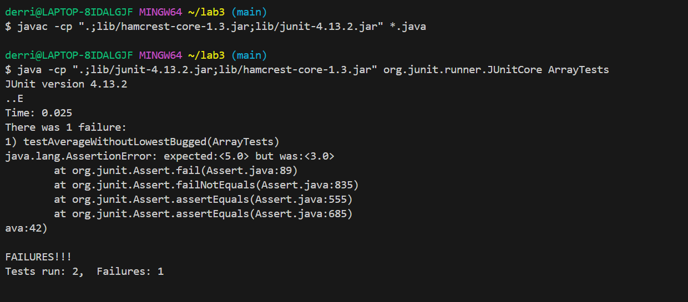

# Lab Report 3 - Bugs and Commands
Derrick Burton

## Part 1: Bugs
1. Failure inducing input:
  ~~~
  @Test
  public void testAverageWithoutLowestBugged(){
    double[] toTest = {6.0,4.0,4.0};
    double expected = 5.0;
    double actual = ArrayExamples.averageWithoutLowest(toTest);
    assertEquals(expected, actual, 0.01);
  }
~~~
2. Input without failure:
~~~
@Test
  public void testAverageWithoutLowestWorks(){
    double[] toTest = {9.0,7.0,5.0,3.0};
    double expected = 7.0;
    double actual =  ArrayExamples.averageWithoutLowest(toTest);
    assertEquals(expected, actual, 0.01);
  }
~~~
3. The symptom:
    

4. Before the change:
   
~~~
static double averageWithoutLowest(double[] arr) {
    if(arr.length < 2) { return 0.0; }
    double lowest = arr[0];
    for(double num: arr) {
      if(num < lowest) { lowest = num; }
    }
    double sum = 0;
    for(double num: arr) {
      if(num != lowest) { sum += num; }
    }
    return sum / (arr.length - 1);
   }
~~~

After the change:

   ~~~
   static double averageWithoutLowest(double[] arr) {
    boolean already = false;
    if(arr.length < 2) { return 0.0; }
    double lowest = arr[0];
    for(double num: arr) {
      if(num < lowest) { lowest = num; }
    }
    double sum = 0;
    for(double num: arr) {
      if (!already && num == lowest){
        already = true;
      }
      else{
         sum += num; 
      }
    }
    return sum / (arr.length - 1);
  }
 ~~~

5. The original issue with this code was that, if the input array had multiple instances of the same number and that number happened to be the lowest in the array, then the method would exlude all those instances when calculating the average. My fix makes it so that once the lowest number is excluded once, it will never be excluded again, effectively fixing this issue.

## Part 2: Researching Commands
The command I chose to use was grep, I chose grep because it felt both very intuitive and essential during our lab. For reference, find-results.txt just includes all the files and directories from technical.
1. Useful command-line -v:
   -v is called invert match, and will exlude and matching lines. I found information on it at grep --help
   ~~~
   $ grep -v ".txt" find-results.txt
   technical/
   technical/911report
   technical/biomed
   technical/government
   technical/government/About_LSC
   technical/government/Alcohol_Problems
   technical/government/Env_Prot_Agen
   technical/government/Gen_Account_Office
   technical/government/Media
   technical/government/Post_Rate_Comm
   technical/plos
   ~~~
What grep is doing here is looking only for lines in the file that dont include ".txt". It is useful because it is essentially finding all the directory paths in find-results.txt.

~~~
derri@LAPTOP-8IDALGJF MINGW64 ~/docsearch (main)
$ grep -v "biomed" find-results.txt
technical/
technical/911report
technical/911report/chapter-1.txt
technical/911report/chapter-10.txt
technical/911report/chapter-11.txt
technical/911report/chapter-12.txt
technical/911report/chapter-13.1.txt
technical/911report/chapter-13.2.txt
technical/911report/chapter-13.3.txt
technical/911report/chapter-13.4.txt
technical/911report/chapter-13.5.txt
technical/911report/chapter-2.txt
technical/911report/chapter-3.txt
technical/911report/chapter-5.txt
technical/911report/chapter-6.txt
technical/911report/chapter-7.txt
technical/911report/chapter-8.txt
technical/911report/chapter-9.txt
technical/911report/preface.txt
technical/government
technical/government/About_LSC
technical/government/About_LSC/Comments_on_semiannual.txt
technical/government/About_LSC/commission_report.txt
technical/government/About_LSC/conference_highlights.txt
technical/government/About_LSC/CONFIG_STANDARDS.txt
technical/government/About_LSC/diversity_priorities.txt
technical/government/About_LSC/LegalServCorp_v_VelazquezDissent.txt
technical/government/About_LSC/LegalServCorp_v_VelazquezOpinion.txt
technical/government/About_LSC/LegalServCorp_v_VelazquezSyllabus.txt
technical/government/About_LSC/ODonnell_et_al_v_LSCdecision.txt
technical/government/About_LSC/ONTARIO_LEGAL_AID_SERIES.txt
technical/government/About_LSC/Progress_report.txt
technical/government/About_LSC/Protocol_Regarding_Access.txt
technical/government/About_LSC/reporting_system.txt
technical/government/About_LSC/Special_report_to_congress.txt
technical/government/About_LSC/State_Planning_Report.txt
technical/government/About_LSC/State_Planning_Special_Report.txt
technical/government/About_LSC/Strategic_report.txt
technical/government/Alcohol_Problems
technical/government/Alcohol_Problems/DraftRecom-PDF.txt
technical/government/Alcohol_Problems/Session2-PDF.txt
technical/government/Alcohol_Problems/Session3-PDF.txt
technical/government/Alcohol_Problems/Session4-PDF.txt
technical/government/Env_Prot_Agen
technical/government/Env_Prot_Agen/1-3_meth_901.txt
technical/government/Env_Prot_Agen/atx1-6.txt
technical/government/Env_Prot_Agen/bill.txt
technical/government/Env_Prot_Agen/ctf1-6.txt
technical/government/Env_Prot_Agen/ctf7-10.txt
technical/government/Env_Prot_Agen/ctm4-10.txt
technical/government/Env_Prot_Agen/final.txt
technical/government/Env_Prot_Agen/jeffordslieberm.txt
technical/government/Env_Prot_Agen/multi102902.txt
technical/government/Env_Prot_Agen/nov1.txt
technical/government/Env_Prot_Agen/ro_clear_skies_book.txt
technical/government/Env_Prot_Agen/section-by-section_summary.txt
technical/government/Env_Prot_Agen/tech_adden.txt
technical/government/Env_Prot_Agen/tech_sectiong.txt
technical/government/Gen_Account_Office
technical/government/Gen_Account_Office/ai00134.txt
technical/government/Gen_Account_Office/ai2132.txt
technical/government/Gen_Account_Office/ai9868.txt
technical/government/Gen_Account_Office/d01121g.txt
technical/government/Gen_Account_Office/d01145g.txt
technical/government/Gen_Account_Office/d01186g.txt
technical/government/Gen_Account_Office/d01376g.txt
technical/government/Gen_Account_Office/d01591sp.txt
technical/government/Gen_Account_Office/d0269g.txt
technical/government/Gen_Account_Office/d02701.txt
technical/government/Gen_Account_Office/d03232sp.txt
technical/government/Gen_Account_Office/d03273g.txt
technical/government/Gen_Account_Office/d03419sp.txt
technical/government/Gen_Account_Office/ffm.txt
technical/government/Gen_Account_Office/gg96118.txt
technical/government/Gen_Account_Office/GovernmentAuditingStandards_yb2002ed.txt
technical/government/Gen_Account_Office/im814.txt
technical/government/Gen_Account_Office/InternalControl_ai00021p.txt
technical/government/Gen_Account_Office/July11-2001_gg00172r.txt
technical/government/Gen_Account_Office/June30-2000_gg00135r.txt
technical/government/Gen_Account_Office/Letter_Walkeraug17let.txt
technical/government/Gen_Account_Office/Letter_WalkerJan30-2001.txt
technical/government/Gen_Account_Office/May1998_ai98068.txt
technical/government/Gen_Account_Office/Oct15-1999_gg00026t.txt
technical/government/Gen_Account_Office/Oct15-2001_d0224.txt
technical/government/Gen_Account_Office/og96009.txt
technical/government/Gen_Account_Office/og96011.txt
technical/government/Gen_Account_Office/og96012.txt
technical/government/Gen_Account_Office/og96014.txt
technical/government/Gen_Account_Office/og96015.txt
technical/government/Gen_Account_Office/og96020.txt
technical/government/Gen_Account_Office/og96021.txt
technical/government/Gen_Account_Office/og96022.txt
technical/government/Gen_Account_Office/og96023.txt
technical/government/Gen_Account_Office/og96026.txt
technical/government/Gen_Account_Office/og96027.txt
technical/government/Gen_Account_Office/og96028.txt
technical/government/Gen_Account_Office/og96031.txt
technical/government/Gen_Account_Office/og96032.txt
technical/government/Gen_Account_Office/og96033.txt
technical/government/Gen_Account_Office/og96034.txt
technical/government/Gen_Account_Office/og96036.txt
technical/government/Gen_Account_Office/og96037.txt
technical/government/Gen_Account_Office/og96038.txt
technical/government/Gen_Account_Office/og96040.txt
technical/government/Gen_Account_Office/og96041.txt
technical/government/Gen_Account_Office/og96042.txt
technical/government/Gen_Account_Office/og96043.txt
technical/government/Gen_Account_Office/og96045.txt
technical/government/Gen_Account_Office/og96047.txt
technical/government/Gen_Account_Office/og97001.txt
technical/government/Gen_Account_Office/og97002.txt
technical/government/Gen_Account_Office/og97003.txt
technical/government/Gen_Account_Office/og97011.txt
technical/government/Gen_Account_Office/og97019.txt
technical/government/Gen_Account_Office/og97020.txt
technical/government/Gen_Account_Office/og97023.txt
technical/government/Gen_Account_Office/og97028.txt
technical/government/Gen_Account_Office/og97032.txt
technical/government/Gen_Account_Office/og97038.txt
technical/government/Gen_Account_Office/og97039.txt
technical/government/Gen_Account_Office/og97041.txt
technical/government/Gen_Account_Office/og97043.txt
technical/government/Gen_Account_Office/og97045.txt
technical/government/Gen_Account_Office/og97046.txt
technical/government/Gen_Account_Office/og97050.txt
technical/government/Gen_Account_Office/og97051.txt
technical/government/Gen_Account_Office/og97052.txt
technical/government/Gen_Account_Office/og98018.txt
technical/government/Gen_Account_Office/og98019.txt
technical/government/Gen_Account_Office/og98022.txt
technical/government/Gen_Account_Office/og98024.txt
technical/government/Gen_Account_Office/og98026.txt
technical/government/Gen_Account_Office/og98029.txt
technical/government/Gen_Account_Office/og98030.txt
technical/government/Gen_Account_Office/og98032.txt
technical/government/Gen_Account_Office/og98040.txt
technical/government/Gen_Account_Office/og98041.txt
technical/government/Gen_Account_Office/og98044.txt
technical/government/Gen_Account_Office/og98045.txt
technical/government/Gen_Account_Office/og98046.txt
technical/government/Gen_Account_Office/og99036.txt
technical/government/Gen_Account_Office/Paper_Walker11-2002_acpro122.txt
technical/government/Gen_Account_Office/pe1019.txt
technical/government/Gen_Account_Office/Sept14-2002_d011070.txt
technical/government/Gen_Account_Office/Sept27-2002_d02966.txt
technical/government/Gen_Account_Office/Statements_Feb28-1997_volume.txt
technical/government/Gen_Account_Office/Testimony_cg00010t.txt
technical/government/Gen_Account_Office/Testimony_d01609t.txt
technical/government/Gen_Account_Office/Testimony_Jul15-2002_d02940t.txt
technical/government/Gen_Account_Office/Testimony_Jul17-2002_d02957t.txt
technical/government/Media
technical/government/Media/5_Legal_Groups.txt
technical/government/Media/Abuse_penalties.txt
technical/government/Media/Advocate_for_Poor.txt
technical/government/Media/agency_expands.txt
technical/government/Media/Aid_Gets_7_Million.txt
technical/government/Media/All_May_Have_Justice.txt
technical/government/Media/Annual_Fee.txt
technical/government/Media/Anthem_Payout.txt
technical/government/Media/AP_LawSchoolDebts.txt
technical/government/Media/Assuring_Underprivileged.txt
technical/government/Media/Attorney_gives_his_time.txt
technical/government/Media/Avoids_Budget_Cut.txt
technical/government/Media/A_helping_hand.txt
technical/government/Media/A_Perk_of_Age.txt
technical/government/Media/balance_scales_of_justice.txt
technical/government/Media/Barnes_new_job.txt
technical/government/Media/Barnes_pro_bono.txt
technical/government/Media/Barnes_Volunteers.txt
technical/government/Media/Barr_sharpening_ax.txt
technical/government/Media/BergenCountyRecord.txt
technical/government/Media/Bias_on_the_Job.txt
technical/government/Media/Boone_legal_service.txt
technical/government/Media/Bridging_legal_aid_gap.txt
technical/government/Media/BusinessWire.txt
technical/government/Media/BusinessWire2.txt
technical/government/Media/Butler_Co_attorneys.txt
technical/government/Media/Campaign_Pays.txt
technical/government/Media/City_Council_Budget.txt
technical/government/Media/Civil_Matters.txt
technical/government/Media/CommercialAppealMemphis2.txt
technical/government/Media/Commercial_Appeal.txt
technical/government/Media/Coup_Reshapes_Legal_Aid.txt
technical/government/Media/Court_Keeps_Judge_From.txt
technical/government/Media/Crains_New_York_Business.txt
technical/government/Media/defend_yourself.txt
technical/government/Media/Disaster_center.txt
technical/government/Media/Do-it-yourself_divorce.txt
technical/government/Media/Domestic_violence_aid.txt
technical/government/Media/Domestic_Violence_Ruling.txt
technical/government/Media/Donald_Hilliker.txt
technical/government/Media/Entities_Merge.txt
technical/government/Media/Eviction_law.txt
technical/government/Media/families_saved.txt
technical/government/Media/Farm_workers.txt
technical/government/Media/Federal_agency.txt
technical/government/Media/Few_who_need.txt
technical/government/Media/fight_domestic_abuse.txt
technical/government/Media/Fire_Victims_Sue.txt
technical/government/Media/Firm_to_the_Poor_Needs_Help.txt
technical/government/Media/FortWorthStarTelegram.txt
technical/government/Media/Free_Legal_Assistance.txt
technical/government/Media/Free_legal_service.txt
technical/government/Media/Funding_cuts_force.txt
technical/government/Media/Funding_May_Limit.txt
technical/government/Media/Funds_Shortage.txt
technical/government/Media/FY_04_Budget_Outlook.txt
technical/government/Media/Ginny_Kilgore.txt
technical/government/Media/Good_guys_reward.txt
technical/government/Media/grants_fail_to_come.txt
technical/government/Media/Greedy_Generous.txt
technical/government/Media/GreensburgDailyNews.txt
technical/government/Media/Hard_to_Get.txt
technical/government/Media/Helping_Hands.txt
technical/government/Media/Helping_Out.txt
technical/government/Media/help_rent-to-own_tenants.txt
technical/government/Media/Higher_court.txt
technical/government/Media/Higher_Registration_Fees.txt
technical/government/Media/highlight_Senior_Day.txt
technical/government/Media/IOLTA_INTEREST_RATE.txt
technical/government/Media/It_Pays_to_Know.txt
technical/government/Media/Justice_for_all.txt
technical/government/Media/Justice_requests.txt
technical/government/Media/Kiosks_for_court_forms.txt
technical/government/Media/Law-school_grads.txt
technical/government/Media/Lawyer_Web_Survey.txt
technical/government/Media/Law_Award_from_College.txt
technical/government/Media/Law_Schools.txt
technical/government/Media/Legal-aid_chief.txt
technical/government/Media/Legal_Aid_attorney.txt
technical/government/Media/Legal_Aid_campaign.txt
technical/government/Media/Legal_Aid_in_Clay_County.txt
technical/government/Media/Legal_Aid_looks_to_legislators.txt
technical/government/Media/Legal_Aid_Society.txt
technical/government/Media/Legal_hotline.txt
technical/government/Media/Legal_services_for_poor.txt
technical/government/Media/Legal_system_fails_poor.txt
technical/government/Media/less_legal_aid.txt
technical/government/Media/Library_Lawyers.txt
technical/government/Media/Lindsays_legacy.txt
technical/government/Media/Local_Attorneys.txt
technical/government/Media/Lockyer_Warns.txt
technical/government/Media/Low-income_children.txt
technical/government/Media/Major_Changes.txt
technical/government/Media/Making_a_case.txt
technical/government/Media/man_on_national_team.txt
technical/government/Media/Marylands_Legal_Aid.txt
technical/government/Media/New_funding_sources.txt
technical/government/Media/New_Online_Resources.txt
technical/government/Media/NJ_Legal_Services.txt
technical/government/Media/Nonprofit_Buys.txt
technical/government/Media/not_accessible_to_disabled.txt
technical/government/Media/Oregon_Poor.txt
technical/government/Media/Owning_a_Piece.txt
technical/government/Media/Paralegal_Honored.txt
technical/government/Media/Philly_Lawyers.txt
technical/government/Media/Politician_Practices.txt
technical/government/Media/Poor_Lacking_Legal_Aid.txt
technical/government/Media/Poverty_Lawyers.txt
technical/government/Media/predatory_loans.txt
technical/government/Media/Pro-bono_road_show.txt
technical/government/Media/Program_Lodges.txt
technical/government/Media/Providing_Legal_Aid.txt
technical/government/Media/pro_bono_efforts.txt
technical/government/Media/Pro_Bono_Services.txt
technical/government/Media/Raising_the_Bar.txt
technical/government/Media/Rental_rules.txt
technical/government/Media/residents_sue_city.txt
technical/government/Media/Retirement_Has_Its_Appeal.txt
technical/government/Media/RoanokeTimes.txt
technical/government/Media/Rumble_in_the_Bronx.txt
technical/government/Media/Self-Help_Website.txt
technical/government/Media/Service_Agency.txt
technical/government/Media/State_funding.txt
technical/government/Media/Supporting_Legal_Center.txt
technical/government/Media/Survey.txt
technical/government/Media/Targeting_Domestic_Violence.txt
technical/government/Media/Terrorist_Attack.txt
technical/government/Media/Texas_Lawyer.txt
technical/government/Media/Texas_Supreme_Court.txt
technical/government/Media/The_Bend_Bulletin.txt
technical/government/Media/The_Columbian.txt
technical/government/Media/The_State_of_Pro_Bono.txt
technical/government/Media/Too_Crucial_to_Take_Cut.txt
technical/government/Media/Towson_Attorney.txt
technical/government/Media/Understanding.txt
technical/government/Media/Unusual_Woodburn.txt
technical/government/Media/Using_Tech_Tools.txt
technical/government/Media/Valley_Needing_Legal_Services.txt
technical/government/Media/Volunteers_Step_Up.txt
technical/government/Media/water_fees.txt
technical/government/Media/Weak_economy.txt
technical/government/Media/Wilmington_lawyer.txt
technical/government/Media/Wingates_winds.txt
technical/government/Media/Workers_aid_center.txt
technical/government/Media/Working_for_Free.txt
technical/government/Post_Rate_Comm
technical/government/Post_Rate_Comm/Cohenetal_comparison.txt
technical/government/Post_Rate_Comm/Cohenetal_Cost_Function.txt
technical/government/Post_Rate_Comm/Cohenetal_CreamSkimming.txt
technical/government/Post_Rate_Comm/Cohenetal_DeliveryCost.txt
technical/government/Post_Rate_Comm/Cohenetal_RuralDelivery.txt
technical/government/Post_Rate_Comm/Cohenetal_Scale.txt
technical/government/Post_Rate_Comm/Gleiman_EMASpeech.txt
technical/government/Post_Rate_Comm/Gleiman_gca2000.txt
technical/government/Post_Rate_Comm/Mitchell_6-17-Mit.txt
technical/government/Post_Rate_Comm/Mitchell_RMVancouver.txt
technical/government/Post_Rate_Comm/Mitchell_spyros-first-class.txt
technical/government/Post_Rate_Comm/Redacted_Study.txt
technical/government/Post_Rate_Comm/ReportToCongress2002WEB.txt
technical/government/Post_Rate_Comm/WolakSpeech_usps.txt
technical/plos
technical/plos/journal.pbio.0020001.txt
technical/plos/journal.pbio.0020010.txt
technical/plos/journal.pbio.0020012.txt
technical/plos/journal.pbio.0020013.txt
technical/plos/journal.pbio.0020019.txt
technical/plos/journal.pbio.0020028.txt
technical/plos/journal.pbio.0020035.txt
technical/plos/journal.pbio.0020040.txt
technical/plos/journal.pbio.0020042.txt
technical/plos/journal.pbio.0020043.txt
technical/plos/journal.pbio.0020046.txt
technical/plos/journal.pbio.0020047.txt
technical/plos/journal.pbio.0020052.txt
technical/plos/journal.pbio.0020053.txt
technical/plos/journal.pbio.0020054.txt
technical/plos/journal.pbio.0020063.txt
technical/plos/journal.pbio.0020064.txt
technical/plos/journal.pbio.0020067.txt
technical/plos/journal.pbio.0020068.txt
technical/plos/journal.pbio.0020071.txt
technical/plos/journal.pbio.0020073.txt
technical/plos/journal.pbio.0020100.txt
technical/plos/journal.pbio.0020101.txt
technical/plos/journal.pbio.0020105.txt
technical/plos/journal.pbio.0020112.txt
technical/plos/journal.pbio.0020113.txt
technical/plos/journal.pbio.0020116.txt
technical/plos/journal.pbio.0020121.txt
technical/plos/journal.pbio.0020125.txt
technical/plos/journal.pbio.0020127.txt
technical/plos/journal.pbio.0020133.txt
technical/plos/journal.pbio.0020140.txt
technical/plos/journal.pbio.0020145.txt
technical/plos/journal.pbio.0020146.txt
technical/plos/journal.pbio.0020147.txt
technical/plos/journal.pbio.0020148.txt
technical/plos/journal.pbio.0020150.txt
technical/plos/journal.pbio.0020156.txt
technical/plos/journal.pbio.0020161.txt
technical/plos/journal.pbio.0020164.txt
technical/plos/journal.pbio.0020169.txt
technical/plos/journal.pbio.0020172.txt
technical/plos/journal.pbio.0020183.txt
technical/plos/journal.pbio.0020187.txt
technical/plos/journal.pbio.0020190.txt
technical/plos/journal.pbio.0020206.txt
technical/plos/journal.pbio.0020213.txt
technical/plos/journal.pbio.0020214.txt
technical/plos/journal.pbio.0020215.txt
technical/plos/journal.pbio.0020216.txt
technical/plos/journal.pbio.0020223.txt
technical/plos/journal.pbio.0020224.txt
technical/plos/journal.pbio.0020228.txt
technical/plos/journal.pbio.0020232.txt
technical/plos/journal.pbio.0020241.txt
technical/plos/journal.pbio.0020262.txt
technical/plos/journal.pbio.0020263.txt
technical/plos/journal.pbio.0020267.txt
technical/plos/journal.pbio.0020272.txt
technical/plos/journal.pbio.0020276.txt
technical/plos/journal.pbio.0020297.txt
technical/plos/journal.pbio.0020302.txt
technical/plos/journal.pbio.0020306.txt
technical/plos/journal.pbio.0020307.txt
technical/plos/journal.pbio.0020310.txt
technical/plos/journal.pbio.0020311.txt
technical/plos/journal.pbio.0020337.txt
technical/plos/journal.pbio.0020346.txt
technical/plos/journal.pbio.0020347.txt
technical/plos/journal.pbio.0020348.txt
technical/plos/journal.pbio.0020350.txt
technical/plos/journal.pbio.0020353.txt
technical/plos/journal.pbio.0020354.txt
technical/plos/journal.pbio.0020394.txt
technical/plos/journal.pbio.0020400.txt
technical/plos/journal.pbio.0020401.txt
technical/plos/journal.pbio.0020404.txt
technical/plos/journal.pbio.0020406.txt
technical/plos/journal.pbio.0020419.txt
technical/plos/journal.pbio.0020420.txt
technical/plos/journal.pbio.0020430.txt
technical/plos/journal.pbio.0020431.txt
technical/plos/journal.pbio.0020439.txt
technical/plos/journal.pbio.0020440.txt
technical/plos/journal.pbio.0030021.txt
technical/plos/journal.pbio.0030024.txt
technical/plos/journal.pbio.0030032.txt
technical/plos/journal.pbio.0030050.txt
technical/plos/journal.pbio.0030051.txt
technical/plos/journal.pbio.0030056.txt
technical/plos/journal.pbio.0030062.txt
technical/plos/journal.pbio.0030065.txt
technical/plos/journal.pbio.0030076.txt
technical/plos/journal.pbio.0030094.txt
technical/plos/journal.pbio.0030097.txt
technical/plos/journal.pbio.0030102.txt
technical/plos/journal.pbio.0030105.txt
technical/plos/journal.pbio.0030127.txt
technical/plos/journal.pbio.0030129.txt
technical/plos/journal.pbio.0030131.txt
technical/plos/journal.pbio.0030136.txt
technical/plos/journal.pbio.0030137.txt
technical/plos/pmed.0010008.txt
technical/plos/pmed.0010010.txt
technical/plos/pmed.0010013.txt
technical/plos/pmed.0010021.txt
technical/plos/pmed.0010022.txt
technical/plos/pmed.0010023.txt
technical/plos/pmed.0010024.txt
technical/plos/pmed.0010025.txt
technical/plos/pmed.0010026.txt
technical/plos/pmed.0010028.txt
technical/plos/pmed.0010029.txt
technical/plos/pmed.0010030.txt
technical/plos/pmed.0010034.txt
technical/plos/pmed.0010036.txt
technical/plos/pmed.0010039.txt
technical/plos/pmed.0010041.txt
technical/plos/pmed.0010042.txt
technical/plos/pmed.0010045.txt
technical/plos/pmed.0010046.txt
technical/plos/pmed.0010047.txt
technical/plos/pmed.0010048.txt
technical/plos/pmed.0010049.txt
technical/plos/pmed.0010050.txt
technical/plos/pmed.0010051.txt
technical/plos/pmed.0010052.txt
technical/plos/pmed.0010056.txt
technical/plos/pmed.0010058.txt
technical/plos/pmed.0010060.txt
technical/plos/pmed.0010061.txt
technical/plos/pmed.0010062.txt
technical/plos/pmed.0010064.txt
technical/plos/pmed.0010066.txt
technical/plos/pmed.0010067.txt
technical/plos/pmed.0010068.txt
technical/plos/pmed.0010069.txt
technical/plos/pmed.0010070.txt
technical/plos/pmed.0010071.txt
technical/plos/pmed.0020002.txt
technical/plos/pmed.0020005.txt
technical/plos/pmed.0020007.txt
technical/plos/pmed.0020009.txt
technical/plos/pmed.0020015.txt
technical/plos/pmed.0020016.txt
technical/plos/pmed.0020017.txt
technical/plos/pmed.0020018.txt
technical/plos/pmed.0020019.txt
technical/plos/pmed.0020020.txt
technical/plos/pmed.0020021.txt
technical/plos/pmed.0020022.txt
technical/plos/pmed.0020023.txt
technical/plos/pmed.0020024.txt
technical/plos/pmed.0020027.txt
technical/plos/pmed.0020028.txt
technical/plos/pmed.0020033.txt
technical/plos/pmed.0020034.txt
technical/plos/pmed.0020035.txt
technical/plos/pmed.0020036.txt
technical/plos/pmed.0020039.txt
technical/plos/pmed.0020040.txt
technical/plos/pmed.0020045.txt
technical/plos/pmed.0020047.txt
technical/plos/pmed.0020048.txt
technical/plos/pmed.0020050.txt
technical/plos/pmed.0020055.txt
technical/plos/pmed.0020059.txt
technical/plos/pmed.0020060.txt
technical/plos/pmed.0020061.txt
technical/plos/pmed.0020062.txt
technical/plos/pmed.0020065.txt
technical/plos/pmed.0020067.txt
technical/plos/pmed.0020068.txt
technical/plos/pmed.0020071.txt
technical/plos/pmed.0020073.txt
technical/plos/pmed.0020074.txt
technical/plos/pmed.0020075.txt
technical/plos/pmed.0020082.txt
technical/plos/pmed.0020085.txt
technical/plos/pmed.0020086.txt
technical/plos/pmed.0020088.txt
technical/plos/pmed.0020090.txt
technical/plos/pmed.0020091.txt
technical/plos/pmed.0020094.txt
technical/plos/pmed.0020098.txt
technical/plos/pmed.0020099.txt
technical/plos/pmed.0020102.txt
technical/plos/pmed.0020103.txt
technical/plos/pmed.0020104.txt
technical/plos/pmed.0020113.txt
technical/plos/pmed.0020114.txt
technical/plos/pmed.0020115.txt
technical/plos/pmed.0020116.txt
technical/plos/pmed.0020117.txt
technical/plos/pmed.0020118.txt
technical/plos/pmed.0020120.txt
technical/plos/pmed.0020123.txt
technical/plos/pmed.0020140.txt
technical/plos/pmed.0020144.txt
technical/plos/pmed.0020145.txt
technical/plos/pmed.0020146.txt
technical/plos/pmed.0020148.txt
technical/plos/pmed.0020149.txt
technical/plos/pmed.0020150.txt
technical/plos/pmed.0020155.txt
technical/plos/pmed.0020157.txt
technical/plos/pmed.0020158.txt
technical/plos/pmed.0020160.txt
technical/plos/pmed.0020161.txt
technical/plos/pmed.0020162.txt
technical/plos/pmed.0020180.txt
technical/plos/pmed.0020181.txt
technical/plos/pmed.0020182.txt
technical/plos/pmed.0020187.txt
technical/plos/pmed.0020189.txt
technical/plos/pmed.0020191.txt
technical/plos/pmed.0020192.txt
technical/plos/pmed.0020194.txt
technical/plos/pmed.0020195.txt
technical/plos/pmed.0020196.txt
technical/plos/pmed.0020197.txt
technical/plos/pmed.0020198.txt
technical/plos/pmed.0020200.txt
technical/plos/pmed.0020201.txt
technical/plos/pmed.0020203.txt
technical/plos/pmed.0020206.txt
technical/plos/pmed.0020208.txt
technical/plos/pmed.0020209.txt
technical/plos/pmed.0020210.txt
technical/plos/pmed.0020212.txt
technical/plos/pmed.0020216.txt
technical/plos/pmed.0020226.txt
technical/plos/pmed.0020231.txt
technical/plos/pmed.0020232.txt
technical/plos/pmed.0020235.txt
technical/plos/pmed.0020236.txt
technical/plos/pmed.0020237.txt
technical/plos/pmed.0020238.txt
technical/plos/pmed.0020239.txt
technical/plos/pmed.0020242.txt
technical/plos/pmed.0020246.txt
technical/plos/pmed.0020247.txt
technical/plos/pmed.0020249.txt
technical/plos/pmed.0020257.txt
technical/plos/pmed.0020258.txt
technical/plos/pmed.0020268.txt
technical/plos/pmed.0020272.txt
technical/plos/pmed.0020273.txt
technical/plos/pmed.0020274.txt
technical/plos/pmed.0020275.txt
technical/plos/pmed.0020278.txt
technical/plos/pmed.0020281.txt
~~~
What grep is doing here is excluding any files and directories that inlcude biomed as part of their path. This allows us to select/look at only hte files and directories not pertaining to biomed.

2. Useful command-line: -c
   -c Allows us to count the amount of lines that contain the designated string, I found info on it from grep --help
~~~
$ grep -c "biomed" find-results.txt
838
~~~
This command is showing us how many lines contain biomed in find-results. Since find-results is a list of all paths and directories in technical, this is useful because it shows us how many files and directories contain "biomed" in their path.
~~~
$ grep -c ".txt" find-results.txt
1391
~~~
This command is showing us how many lines contain ".txt" in find-results. Since find-results is a list of all paths and directories in technical, this is useful because it shows us how many txt files there are in technical. This is an alternate way of finding the amount of ".txt" files than we learned form the lab.

3. Useful command-line: --max-count=NUM
   This command-line allows us to specify the maximum amount of lines contained the string that will be printed.
~~~
$ grep --max-count=20 "a" technical/biomed/1468-6708-3-7.txt
        Background
        With the publication of the Antihypertensive and
        Lipid-Lowering Treatment to prevent Heart Attack Trial
        (ALLHAT), the role of peripheral alpha-1 antagonists in the
        treatment of hypertension has become controversial. The
        doxazosin arm of ALLHAT was stopped early, due to a
        doubling of the incidence of congestive heart failure in
        this group, as compared to the low-dose chlorthalidone arm
        [ 1 ] . Prior to this publication, there had been no
        obvious suggestion of a mechanism by which peripheral
        alpha-1 antagonists in general or doxazosin in particular
        would be inferior to chlorthalidone or would specifically
        cause CHF. Because ALLHAT is an active-control trial, no
        inferences can be made on whether this increased incidence
        of CHF results from a harmful effect of doxazosin, a
        beneficial effect of chlorthalidone, or both. Nonetheless,
        there has been a large body of literature dedicated to the
        positive effects of peripheral alpha-1 antagonists on
        surrogate endpoints such as cholesterol levels and
        tolerability. In light of the results of ALLHAT, we
~~~
This command is useful because it only shows us the first 20 lines containing "a", rather than every single line containing "a". This can prevent our terminal from being packed and hard to read, while also allowing us to sift through the first pieces of information with the option to select more.

~~~
$ grep --max-count=1 "ALLHAT" technical/biomed/1468-6708-3-7.txt
        (ALLHAT), the role of peripheral alpha-1 antagonists in the
~~~
This command shows us only the first instance of "ALLHAT". This is useful for two reason, for one, it allows us to swiftly determine that ALLHAT is referenced at all in the file. Secondly, reading the line allows us to quickly ascertain that the ALLHAT the file is referencing the the ALLHAT we are interested in.

