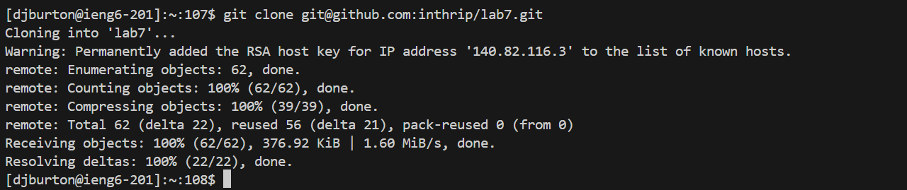

# Lab Report 4 - Vim
Derrick Burton

## Step 4:
### Log into ieng6
1. 
2. Keys pressed: `ssh<space>djburton@ieng6.ucsd.edu<enter>`
3. I used only the `ssh` command which allowed me to connect to ieng6.

## Step 5:
### Clone your fork of the repository from your Github account
1. 
2. Keys presssed: `git<space>clone<space>git@github.com:inthrip/lab7.git<enter>`
3. I used the `git clone` command with the SSH URL of my fork which cloned my fork into ieng6.

## Step 6:
### Run the tests, demonstrating they fail
1. 
2. Keys pressed: `cd<space>lab7<enter>`,`bash<space>test.sh<enter>`
3. I used the `cd` command to change to the directory I had just cloned, then used the `bash` command to run the tests in test.sh.

## Step 7:
### Edit the code to fix the failing tests
1. 
2. Keys pressed: `vim<space>ListExamples.java<enter>`,`<G><k><k><k><k><k><k><E><x><i>2<esc>:wq<enter>`
3. I used the `vim` command along with the file name to enter the vim editor for the file. Once in the file, I used `<G>` to go to the end of the file, since I knew the mistake was located near there. From the end of the file, I inputted `<k><k><k><k><k><k>` to go up 6 lines and reach the line where the mistake was located. Inputting `<E>` on the line where the mistake is located brought me to the end of the first word on that line, which puts my cursor exactly where the mistake is located. With my cursor on the mistake, I inputted `<x>` while in command mode to delete the errant number, inputted `<i>` to swap to insert mode on my cursor, and then inputted `2` to completely fix the mistake. Given the mistake was now fixed, all that was left to do was save and exit the the file, to do this I inputted `<esc>` to swap back to command mode then `:wq<enter>` to exit the file with saving.

## Step 8:
### Run the tests, demonstrating that they now succeed
1. 
2. Keys pressed: `<up><up><enter>`
3. The `bash test.sh` was already in my history for this terminal, so I used `<up><up>` to reacess it without having to retype it, from there I simply hit `<enter>` to run the command.

## Step 9:
### Commit and push the resulting change to your Github account
1. 
2. Keys pressed: `git<space>add<space>ListExamples.java<enter>`,`git<space>commit<space>-m<space>"All<space>tests<space>now<space>pass"<enter>`, `git<space>push<enter>`
3. I used the `git add` along with the name of the edited file, to add that specfic file to the staging area. From there, I used the `git commit -m` command to commit the file to the repository and included a message that conveyed that the tests were all now passing. Finally, I used the `git push` command to push the changes onto GitHub.
